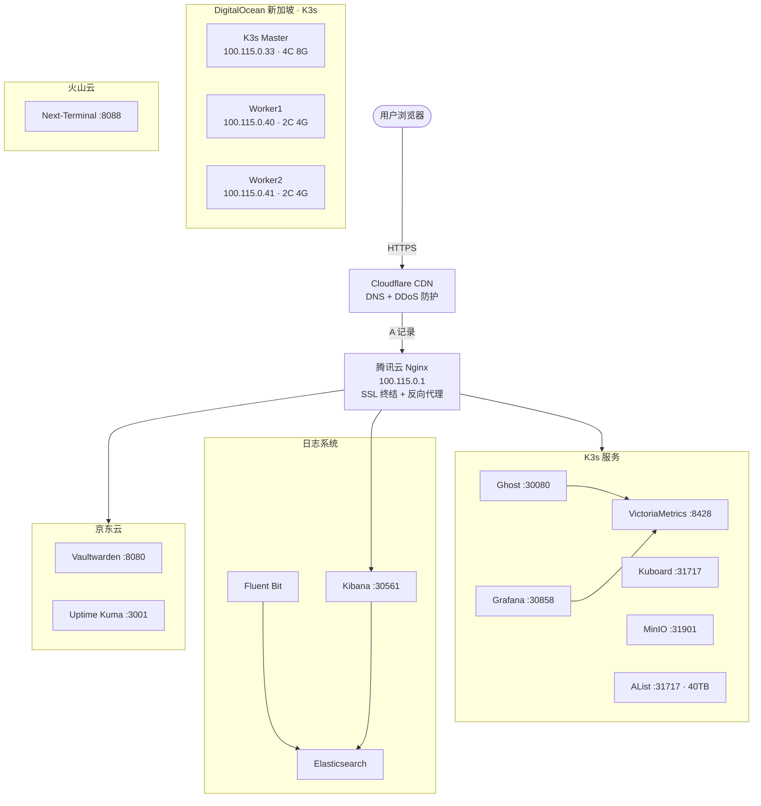

# Pineapple Ops

多云基础设施运维配置仓库。

> Notion 文档：[Pineapple-Ops 多云运维平台](https://www.notion.so/358867ff7fda80bd93c8e3eacd587fa6)

## 架构



> 源文件：[docs/architecture.mmd](docs/architecture.mmd)

## 节点

| 节点 | 云厂商 | Tailscale IP | 配置 | 角色 |
| :--- | :--- | :--- | :--- | :--- |
| K3s Master | DigitalOcean | `100.115.0.33` | 4C 8G 160G | K3s 控制面 + Runner |
| K3s Worker1 | DigitalOcean | `100.115.0.40` | 2C 4G 80G | K3s 工作节点 + Runner |
| K3s Worker2 | DigitalOcean | `100.115.0.41` | 2C 4G 80G | K3s 工作节点 + Runner |
| Nginx | 腾讯云 | `100.115.0.1` | 2C 2G 50G | 反向代理 + SSL |
| 工具节点 | 京东云 | `100.115.0.2` | 2C 4G 60G | Vaultwarden + Uptime Kuma |
| 堡垒机 | 火山云 | `100.115.0.3` | 2C 2G 40G | Next-Terminal (仅内网) |

## 脚本

### 初始化脚本 (`scripts/init/`)

服务器装机时一次性执行：

| 脚本 | 用途 | 适用节点 |
| :--- | :--- | :--- |
| `int.sh` | 通用初始化 | 所有节点 |
| `int-nginx.sh` | Nginx 网关 | 腾讯云 Nginx |
| `int-docker.sh` | Docker 环境 | 京东云 |
| `int-k3s.sh` | K3s 集群 | DigitalOcean |
| `int-bastion.sh` | 堡垒机 | 火山云 |
| `setup_python.sh` | Python 环境 + venv | 所有节点 |

```bash
# 1. 通用初始化 (所有节点先运行)
sudo bash scripts/init/int.sh

# 2. Nginx 节点
sudo bash scripts/init/int-nginx.sh

# 3. Docker 节点
sudo bash scripts/init/int-docker.sh

# 4. K3s Master
sudo bash scripts/init/int-k3s.sh master

# 5. K3s Worker (在 Master 获取 token 后执行)
sudo bash scripts/init/int-k3s.sh worker 100.115.0.33 <token>

# 6. 堡垒机
sudo bash scripts/init/int-bastion.sh

# 7. Python 环境
sudo bash scripts/init/setup_python.sh
```

环境变量：

```bash
# int.sh
REGION=bj PROVIDER=tencent ROLE=nginx SEQ=01 sudo bash int.sh

# int-docker.sh (国内镜像源)
NODE_LOCATION=cn sudo bash int-docker.sh

# int-docker.sh (自定义数据目录)
DOCKER_DATA_DIR=/data/docker sudo bash int-docker.sh
```

### 运维工具 (`scripts/tools/`)

日常运维使用，需先激活 Python 虚拟环境：

```bash
source /home/venv/bin/activate
```

| 脚本 | 用途 | 用法 |
| :--- | :--- | :--- |
| `server_info.py` | 服务器信息巡检 | `python3 scripts/tools/server_info.py` |
| `log_parser.py` | 日志关键字扫描 | `python3 scripts/tools/log_parser.py -f /var/log/syslog -k error` |
| `system_monitor.py` | CPU/内存实时监控 | `python3 scripts/tools/system_monitor.py` |

### 备份脚本 (`scripts/backup/`)

| 脚本 | 用途 |
| :--- | :--- |
| `backup-db.sh` | 数据库备份 |

## 服务路由

Nginx 统一入口，SSL 终结后转发至各服务：

| 域名 | 服务 | 后端 |
| :--- | :--- | :--- |
| `pineapple-user.site` | Ghost 博客 | K3s Ingress |
| `ghost.pineapple-user.site` | Ghost 后台 | K3s Ingress |
| `kuboard.pineapple-user.site` | Kuboard 管理 | K3s Ingress |
| `grafana.pineapple-user.site` | Grafana 监控 | K3s Ingress |
| `minio.pineapple-user.site` | MinIO 控制台 | K3s Ingress |
| `drive.pineapple-user.site` | AList 网盘 | K3s Ingress |
| `pass.pineapple-user.site` | Vaultwarden | `100.115.0.2:8080` |
| `status.pineapple-user.site` | Uptime Kuma | `100.115.0.2:3001` |
| `kibana.pineapple-user.site` | Kibana 日志面板 | `100.115.0.33:30561` |
| `*.pineapple-user.site` | K3s 通配 | K3s Ingress |

## 技术栈

| 组件 | 用途 |
| :--- | :--- |
| K3s | 轻量级 Kubernetes 集群 |
| Tailscale | 零配置 Mesh VPN (`100.115.0.0/24`) |
| Nginx | 反向代理 + SSL 终结 |
| Ghost | 博客/CMS 平台 |
| Grafana | 监控可视化面板 |
| VictoriaMetrics | 时序数据库 (Prometheus 兼容) |
| EFK (Elasticsearch + Fluent Bit + Kibana) | 日志收集与查询 |
| node_exporter | 系统指标采集 (除堡垒机外全节点) |
| Vaultwarden | 自托管密码管理器 |
| Uptime Kuma | 服务可用性监控 |
| Next-Terminal | 堡垒机 / 运维审计 |
| Kuboard | K3s 集群 Web 管理 |
| MinIO | S3 兼容对象存储 |
| AList | 网盘聚合 (115 网盘 40TB) |
| MariaDB + Redis | 数据库 + 缓存 |
| Resend | 邮件发送服务 (`ghost@tentative.me`) |
| Playwright + Chromium | Grafana 截图 + PDF 生成 |
| Cloudflare | DNS 管理 + CDN |

## 目录结构

```text
.
├── docker/
│   ├── docker-compose.yaml      # 京东云容器配置
│   └── nginx/                   # Nginx 配置
│       ├── pineapple-user.site.conf
│       ├── snippets/
│       └── ssl/
├── docs/
│   └── architecture.mmd         # Mermaid 架构图
├── k3s/
│   ├── efk/                     # EFK 日志系统
│   │   ├── elasticsearch.yaml
│   │   ├── fluent-bit.yaml
│   │   ├── kibana.yaml
│   │   └── ilm-setup.yaml
│   ├── ghost-k3s.yaml           # Ghost 博客
│   ├── minio-k3s.yaml           # MinIO 对象存储
│   ├── alist-k3s.yaml           # AList 网盘
│   └── kuboard-create-token.yaml
└── scripts/
    ├── init/                    # 初始化脚本（装机时执行）
    ├── tools/                   # 运维工具（日常使用）
    └── backup/                  # 备份脚本
```
